# Joint-Savings-Account

## Background
A fintech startup company has recently hired me. This company is disrupting the finance industry with its own cross-border, Ethereum-compatible blockchain that connects financial institutions. Currently, the team is building smart contracts to automate many of the institutions’ financial processes and features, such as hosting joint savings accounts.

To automate the creation of joint savings accounts, I have created a Solidity smart contract that accepts two user addresses. These addresses will be able to control a joint savings account. My smart contract will use ether management functions to implement a financial institution’s requirements for providing the features of the joint savings account. These features will consist of the ability to deposit and withdraw funds from the account.

## Compile and Deploy the Smart Contract
1. Open the Solidity file named `joint_savings.sol` in the Remix IDE.
2. Compile the smart contract. Choose `0.5.0+commit.1d4f565a` under `COMPILER`.

    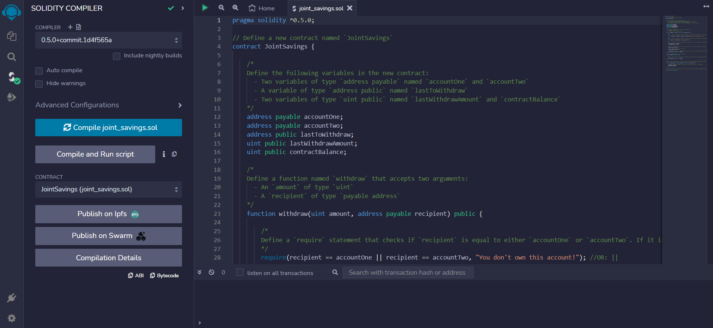

3. In the Remix IDE, navigate to the `Deploy & Run Transactions` pane, and then make sure that `Ganache Provider` is selected as the environment.

    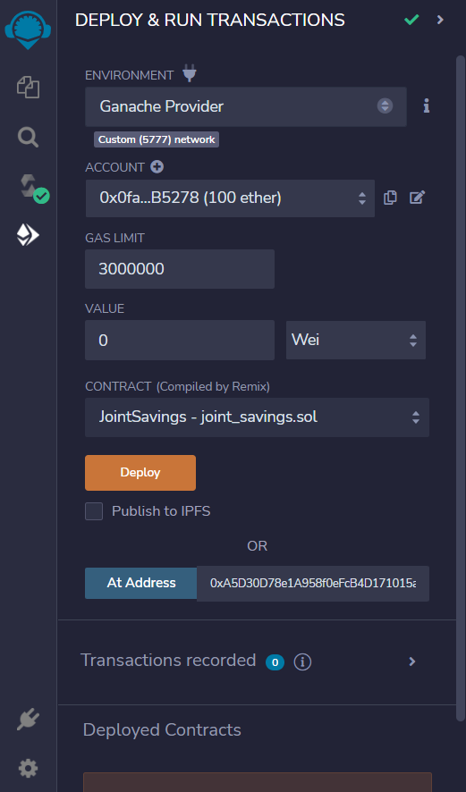

4. Click the Deploy button to deploy the smart contract, and a message in the console will confirm that it is successfully deployed. You can also see the deployed contract under `Deployed Contrcts` section on the sidebar.

    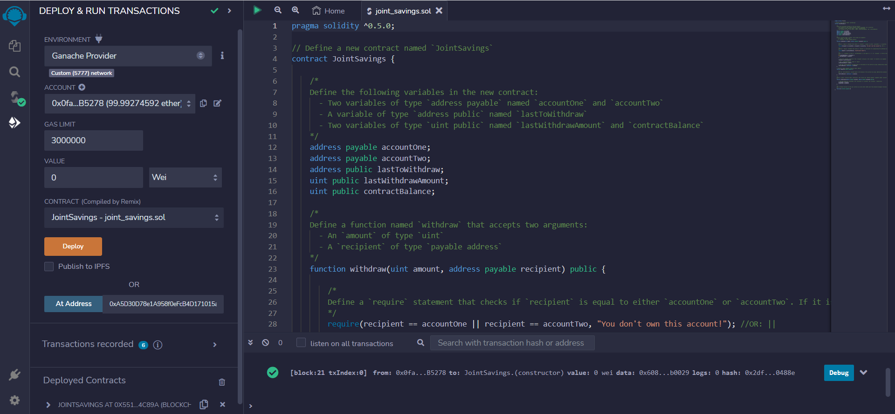

## Interact with The Deployed Smart Contract
Now that the smart contract is deployed, it is time to test its functionality! To interact with the deployed smart contract, complete the following steps:

1. Use the `setAccounts` function to define the authorized Ethereum address that will be able to withdraw funds from the contract.

    For demonstration purpose, I used the following dummy Ethereum addresses:

    `Dummy account1 address: 0x0c0669Cd5e60a6F4b8ce437E4a4A007093D368Cb`

    `Dummy account2 address: 0x7A1f3dFAa0a4a19844B606CD6e91d693083B12c0`

    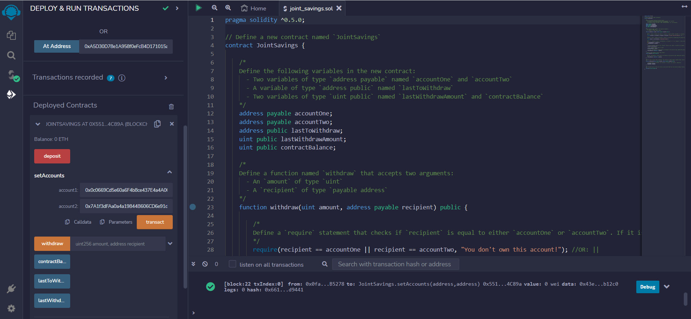

2. Test the `deposit` functionality of the smart contract by sending the following amounts of ether. After each transaction, use the `contractBalance` function to verify that the funds were added to the contract:

    Note: I used `Ethereum Unit Converter` website to convert ether to wei.

* Transaction 1: Send 1 ether as wei.

    Before transaction 1, I have converted 1 ether to wei. Note that the Balance shows `0 ETH`.
    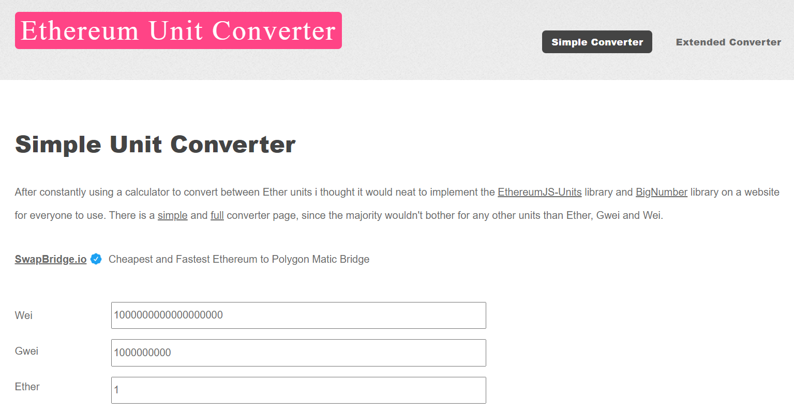
    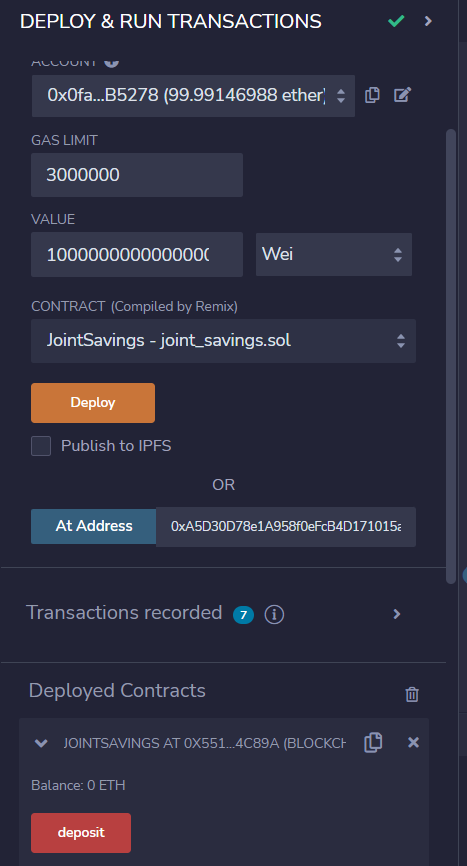

    After transaction 1 was successfully executed, you can see that the Balance became `1 ETH`. And the contractBalance changed accordingly as well.
    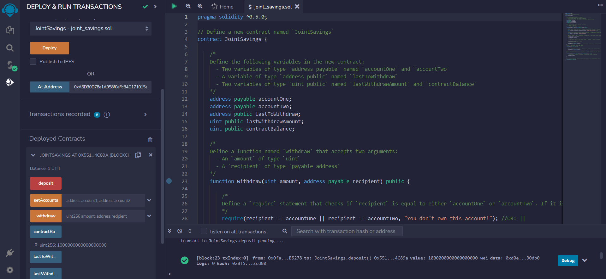

* Transaction 2: Send 10 ether as wei.

    Before transaction 2, I have converted 10 ether to wei. Note that the Balance shows `1 ETH`.
    
    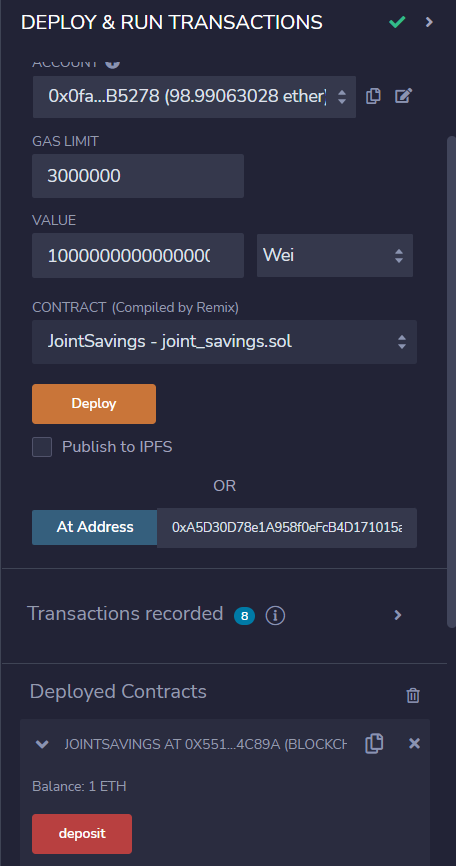

    After transaction 2 was successfully executed, you can see that the Balance became `11 ETH`. And the contractBalance changed accordingly as well.
    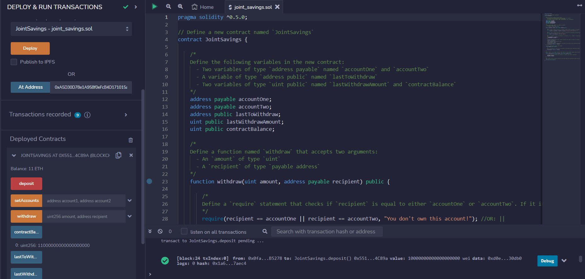

* Transaction 3: Send 5 ether.

    Before transaction 3, please take note that the Balance shows `11 ETH`.
    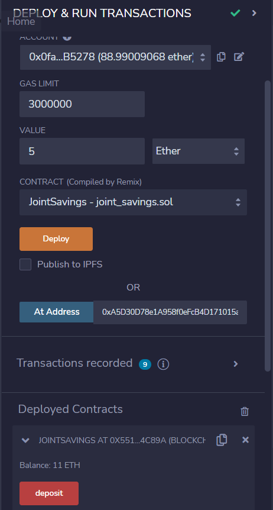

    After transaction 3 was successfully executed, you can see that the Balance became `16 ETH`. And the contractBalance changed accordingly as well.
    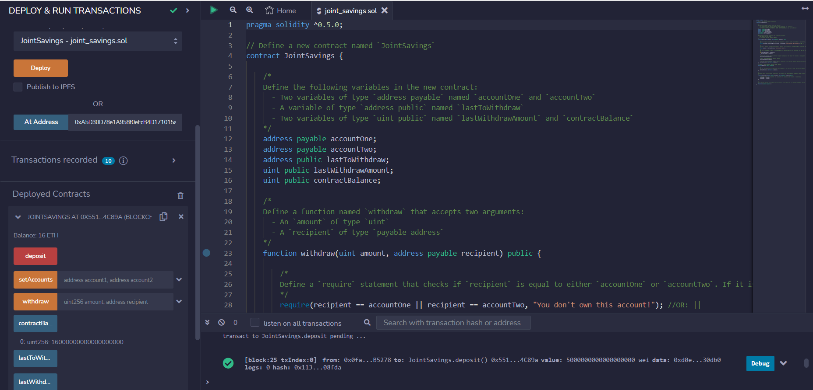

3. Once you have successfully deposited funds into your contract, test the contract’s `withdrawal` functionality by withdrawing `5 ether` into `accountOne` and `10 ether` into `accountTwo`. 

    After each transaction, use the `contractBalance` function to verify that the funds were withdrawn from your contract. Also, use the `lastToWithdraw` and `lastWithdrawAmount` functions to verify that the address and amount were correct.

    Note: when withdrawing, the amount is counted in wei.

* Withdraw `5 ether` into `accountOne`:
    
    Before withdrawing `5 ether` into `accountOne`, I first converted 5 ether to wei. Note that the Balance shows `16 ETH`. I then input the amount as `5000000000000000000` wei and the `account1 address` into `address`.
    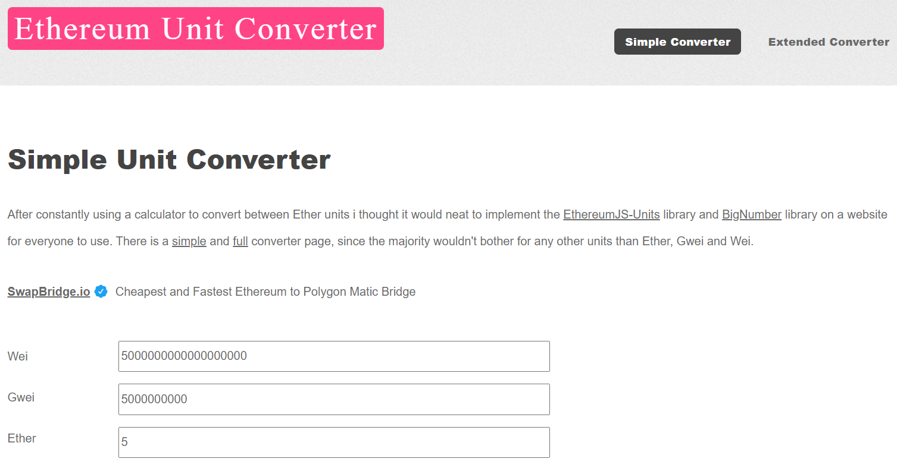
    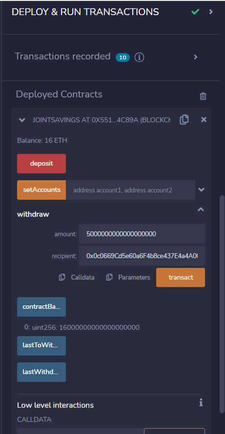

    After withdrawing `5 ether` into `accountOne`, note that the Balance became `11 ETH`, the `contractBalance` also showed `11 ETH` in wei. The `lastToWithdraw` showed `account1 address` and `lastWithdrawAmount` showed `5000000000000000000` wei. All these fields matched with the amount and recipients for the withdrawal.
    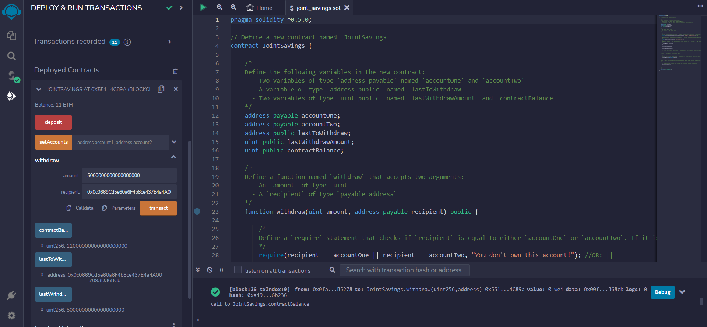

* Withdraw `10 ether` into `accountTwo`:

    Before withdrawing `10 ether` into `accountTwo`, please note that the Balance shows `11 ETH`. I then input the amount as `10000000000000000000` wei and the `account2 address` into `address`.
    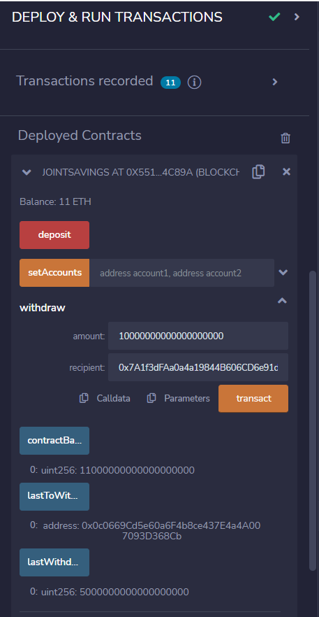

    After withdrawing `10 ether` into `accountTwo`, note that the Balance became `1 ETH`, the `contractBalance` also showed `11 ETH` in wei. The `lastToWithdraw` showed `account2 address` and `lastWithdrawAmount` showed `10000000000000000000` wei. All these fields matched with the amount and recipients for the withdrawal.
    
